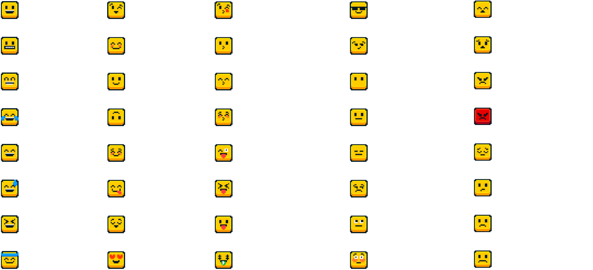
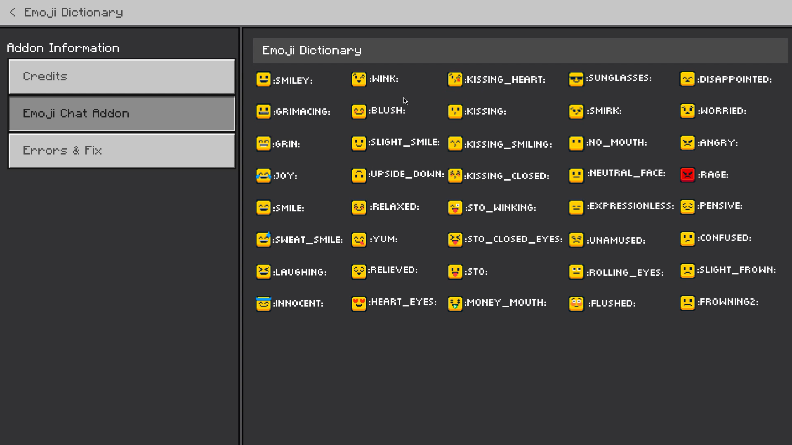

<h1> Minecraft Emoji Chat Addon </h1>

Emoji Chat is an addon that lets you express the way you feel through emojis. With over 40 emoticons at your disposal, you can virtually smile or frown at someone if you want to be sarcastic or show sadness.

## Credits

This addon was created by @keyyard.
Assets were designed by @RealJoshMC.

### Social Media:

- Twitter: [@keyyard](https://twitter.com/keyyard)
- Youtube: [keyyard](https://youtube.com/c/keyyard)

### Contributors:

- justAsh: script assisting in v0.0.1

## Features

- **Emoji Chat:** Send emojis directly in the chat!
- **Emoji Dictionary:** Quickly look up emojis that match your mood.
- **Over 40 Emojis:** Choose from a wide range of emoticons to express yourself.
- **Customizable:** Add your own emojis to the chat.
- **Easy to Use:** Simply type the emoji code in the chat to display the emoticon.

## How to Use

_before get in the world, please turn on the "Beta-API" option in the world settings._

To use Emoji Chat, follow these steps:

1. Open the chat window.
2. Type the emoji code in your chat message.
3. Press Enter to send the emoji.

> Example: :smiley: for smiley icon

## Emoji Dictionary

Emoji Dictionary, which is featured in the How to play section, allows you to quickly seek up emojis that match your mood.

## Customization _advanced_

You can customize Emoji Chat by changing the emojis images in the resource pack. Simply replace the existing images with your own to create a unique chat experience.

Or, you can add your own emojis, i have placed a template in this repository, you can use that to create your own emojis and contribute to this repository! I will credit you for your contribution & get it added to the addon!

## Preview Video (Click to Watch)

## FAQ (Frequently Asked Questions)

**Q: Why is this addon on my GitHub?**
A: This addon serves a special purpose within the Minecraft community, which is why it is hosted on my GitHub repository. It is an open-source project, meaning that anyone can participate in its development. By making it accessible to the community, it encourages collaboration and the sharing of ideas, allowing for continuous improvement. Moreover, having it on GitHub facilitates the creation of customized versions that cater to individual preferences and gameplay styles.

**Q: Are there any compatibility issues with other mods?**
A: This addon is compatible with most other mods. However, conflicts may occur if there are overlapping functionalities. This addon currently uses player behaviour files.

**Q: How do I install the Tree Capitator and Vein Miner Addon?**
A: To install the addon, follow these steps:

1.  Download the addon files from the GitHub repository, or MCPEDL, or any other **trusted** source.
2.  Open the file in Minecraft and that's done!

**Q: Is this addon available for Bedrock Edition or Java Edition?**
A: This addon is specifically designed for Bedrock Edition.

**Q: Can I modify or redistribute this addon?**
A: Modifying or redistributing this addon without permission from the creator is not permitted. Please respect the creator's work and rights.
But you can fork this repository and make your own version of this addon, and you can also contribute to this repository!! You will be credited for your contribution.

Please use these features responsibly and enjoy a more pleasuring gameplay experience.

## Download

Emoji Chat: [Download](https://loot-link.com/s?7f9c0e8b)
